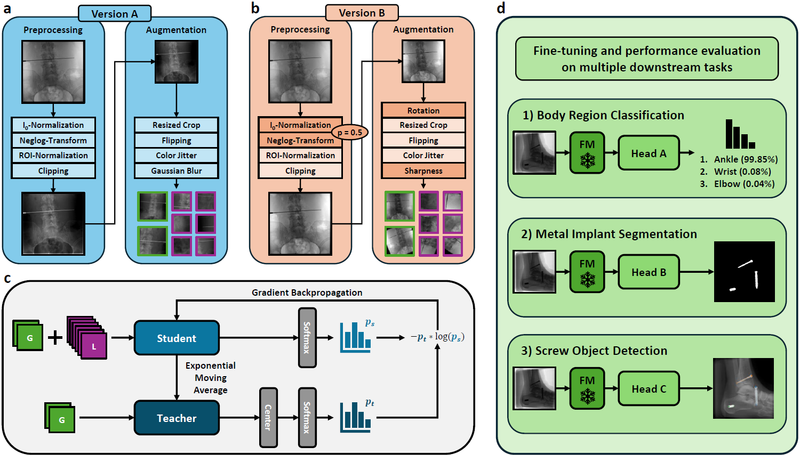
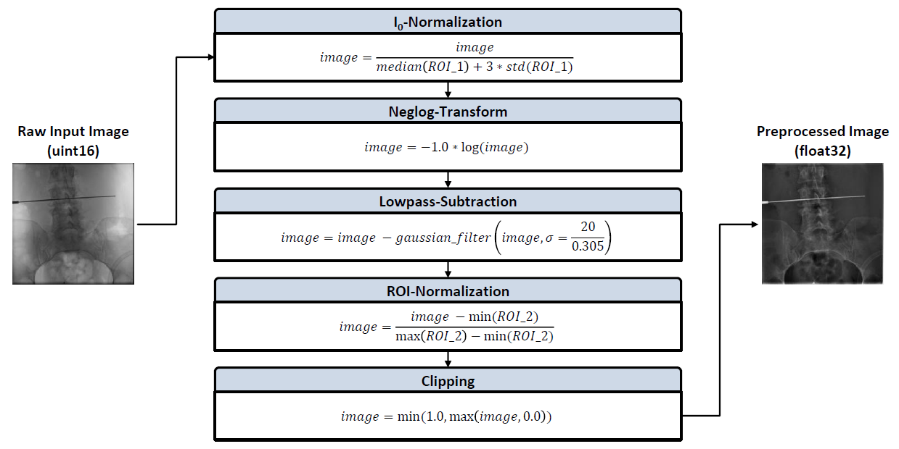

# DINO Adapted to X-Ray (DAX)
In this repository, we provide the official implementation of "DINO Adapted to X-ray (DAX)", a novel framework that specifically adapts [DINO](https://github.com/facebookresearch/dino) for training foundational feature extraction backbones tailored to intraoperative X-ray imaging in orthopedic procedures. In addition, model checkpoints that were pretrained on a novel dataset comprising over 632,000 image samples are made available as well.

## Method


## Checkpoints

| Model                | # Parameters  | Download                           |
|----------------------|--------------:|:----------------------------------:|
| DAX-ResNet18-vA      | 11.2 M        | [Checkpoint](https://huggingface.co/joshua-scheuplein/DAX-ResNet18-A/resolve/main/dax-checkpoint-resnet18-version-a.pth) |
| DAX-ResNet50-vA      | 23.5 M        | [Checkpoint](https://huggingface.co/joshua-scheuplein/DAX-ResNet50-A/resolve/main/dax-checkpoint-resnet50-version-a.pth) |
| DAX-ResNet50-vB      | 23.5 M        | [Checkpoint](https://huggingface.co/joshua-scheuplein/DAX-ResNet50-B/resolve/main/dax-checkpoint-resnet50-version-b.pth) |
| DAX-ViT-T-16-vA      | 5.5 M         | [Checkpoint](https://huggingface.co/joshua-scheuplein/DAX-ViT-T-16-A/resolve/main/dax-checkpoint-vit-t-16-version-a.pth) |
| DAX-ViT-T-8-vA       | 5.5 M         | [Checkpoint](https://huggingface.co/joshua-scheuplein/DAX-ViT-T-8-A/resolve/main/dax-checkpoint-vit-t-8-version-a.pth)   |
| DAX-ViT-S-16-vA      | 21.7 M        | [Checkpoint](https://huggingface.co/joshua-scheuplein/DAX-ViT-S-16-A/resolve/main/dax-checkpoint-vit-s-16-version-a.pth) |
| DAX-ViT-S-16-vB      | 21.7 M        | [Checkpoint](https://huggingface.co/joshua-scheuplein/DAX-ViT-S-16-B/resolve/main/dax-checkpoint-vit-s-16-version-b.pth) |
| DAX-ViT-S-8-vA       | 21.7 M        | [Checkpoint](https://huggingface.co/joshua-scheuplein/DAX-ViT-S-8-A/resolve/main/dax-checkpoint-vit-s-8-version-a.pth)   |

## Training
To start a new model pre-training using DAX (e.g., for a ResNet50 backbone), execute the following command:
```bash
torchrun --nproc_per_node=4 main_dax_training.py --arch='resnet50' --norm_last_layer=True --use_bn_in_head=True --use_fp16=False --clip_grad=0 --global_crops_scale 0.14 1.0 --local_crops_scale 0.05 0.14 --local_crops_number=6 --dataset='DAX-Dataset-{version}' --data_path='path/to/dataset' --augmentation='v2' --output_dir='path/to/output/directory' --num_workers=10 --seed=0 --weight_decay=1e-6 --weight_decay_end=1e-6 --batch_size_per_gpu=128 --epochs=200 --freeze_last_layer=1 --saveckp_freq=1 --warmup_teacher_temp=0.04 --teacher_temp=0.07 --warmup_teacher_temp_epochs=25 --lr=0.3 --warmup_epochs=10 --min_lr=0.0048 --optimizer='lars' --momentum_teacher=0.996 --out_dim=60000 --job_ID='DAX_Training_Job_xxx' --use_wandb='False' --pretrained_weights='path/to/checkpoint' --subtract_lowpass='False' --azure='True'
```

## Evaluation
In order to use the already pretrained DAX backbones for feature extraction in a custom downstream task, the script [load_checkpoints.py](code/load_checkpoints.py) demonstrates how the provided checkpoints can be loaded and used based on only a few lines of code. However, one should always apply the same image preprocessing that has also been used during model pretraining, such that the distribution of the input data aligns with the checkpoint weights. The detailed implementation of all preprocessing steps can be found in the script [utils.py](code/utils.py) and are summarized in the following figure:


## License
DAX code is released under the Apache License 2.0. See [LICENSE](LICENSE) for additional details.

## Citation
tbd.
